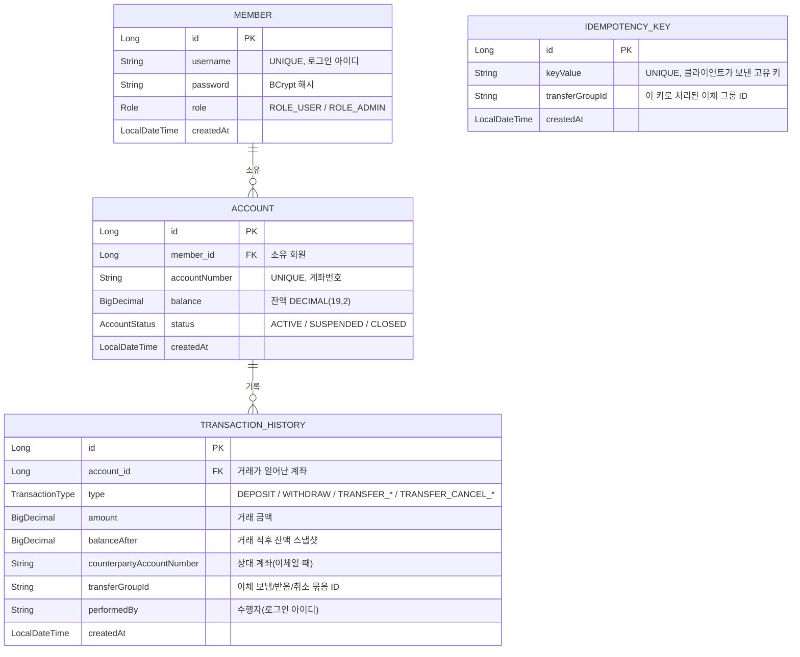

# 계좌이체 뱅킹 시스템

프로젝트 명: 뱅킹투

## 개발 배경
```
계좌 이체 기능은 화면만 보면 단순해 보이지만 실제로는 여러 사용자가 동시에 요청할 수 있고, 같은 요청이 중복으로 들어올 수도 있으며, 처리 도중 오류가 발생해도 데이터가 꼬이지 않아야 합니다.

이 프로젝트는 이러한 상황을 직접 다뤄보기 위해 만들었습니다.

회원 인증부터 계좌 관리, 입출금, 계좌이체까지 구현하면서 트랜잭션 처리, 동시성 문제, 권한 검증, 거래 기록 관리 등을 고민했고, 특히 금융 서비스에서 중요하게 다루는 데이터 정합성에 초점을 맞춰 설계했습니다.

계좌이체 과정에서는 비관적 락을 적용해 동시 요청으로 인한 잔액 불일치를 방지했고, 멱등성 키를 통해 중복 요청이 발생해도 거래가 한 번만 처리되도록 구현했습니다. 또한 거래 취소 시 기존 데이터를 삭제하지 않고 반대 거래를 추가하는 방식으로 기록이 계속 남도록 설계했습니다.

기능 구현 자체보다 실제 서비스에서 발생할 수 있는 문제를 어떻게 처리할지 고민하면서 개발한 프로젝트입니다.
```

## 사용 기술

- Java 21
- Spring Boot 3.5
- Spring Security + JWT (jjwt)
- Spring Data JPA
- H2 (인메모리 DB)/MySQL
- Gradle

## ERD (데이터 모델)

엔티티는 회원(member), 계좌(account), 거래내역(transaction_history), 멱등성 키(idempotency_key) 네 개로 구성하였다.
한 회원은 여러 계좌를 가질 수 있고(1:N), 한 계좌에는 여러 거래내역이 쌓이는(1:N) 구조다.



> `idempotency_key`는 FK로 직접 연결하지 않고, `transferGroupId` 값으로 거래내역과 느슨하게 연결된다.
> 이체 한 건을 보냄(`TRANSFER_OUT`) / 받음(`TRANSFER_IN`)으로 두 줄 쌓고, 같은 `transferGroupId`로 묶어 한 거래로 추적할 수 있게 했다.

## 계층 아키텍처

흔히 쓰는 Controller - Service - Repository 3계층 구조로 나눴다.
요청이 들어오면 인증 필터를 먼저 거치고, 그다음 계층을 따라 내려가도록 했다.

```text
        [ HTTP 요청 ]
             │
             ▼
  ┌────────────────────────┐   JwtAuthenticationFilter
  │   Security (필터)       │ ← 토큰 검증 후 인증 정보 주입
  └────────────────────────┘   SecurityConfig / JwtTokenProvider
             │
             ▼
  ┌────────────────────────┐   요청/응답을 DTO로 받고 내보냄
  │   Controller (표현)    │   Auth/Account/Transfer/Transaction/Admin
  └────────────────────────┘
             │
             ▼
  ┌────────────────────────┐   트랜잭션 경계, 비즈니스 로직
  │   Service (비즈니스)   │   AuthService / AccountService / TransferService ...
  └────────────────────────┘
             │
             ▼
  ┌────────────────────────┐   Spring Data JPA
  │   Repository (영속성)  │   AccountRepository / MemberRepository ...
  └────────────────────────┘
             │
             ▼
  ┌────────────────────────┐   잔액 규칙은 엔티티가 스스로 책임짐
  │   Entity (도메인)      │   Account.deposit() / withdraw() 등
  └────────────────────────┘
             │
             ▼
        [ H2 Database ]
```

- **Controller**: 외부 요청을 받아 DTO로 변환하고 Service에 위임한다. 비즈니스 로직은 두지 않으려고 했다.
- **Service**: `@Transactional`로 트랜잭션 경계를 잡고 핵심 로직을 처리한다. (이체 시 비관적 락, 멱등성 처리 등)
- **Repository**: Spring Data JPA 인터페이스로 DB 접근만 담당한다.
- **Entity(도메인)**: 잔액 증감·상태 검증 같은 규칙을 엔티티 안에 두어, 서비스가 잔액을 직접 건드리지 않고 `account.withdraw(amount)`처럼 도메인에 맡기도록 했다.
- **공통**: 예외는 `GlobalExceptionHandler`에서 한곳에 모아 처리하고, 에러 코드는 `ErrorCode` enum으로 관리한다.

## 주요 기능

### 회원가입 / 로그인

- **문제 정의**: 인증 정보를 안전하게 저장하고, 인증 이후 매 요청마다 사용자를 식별할 방법이 필요하였다.
- **위험 요소 고려**: 비밀번호를 평문이나 단순 해시로 저장하면 DB가 유출됐을 때 원문이 그대로 노출되고, 레인보우 테이블·무차별 대입 공격(Brute Force)에도 취약하다. 처음엔 "그냥 해시만 하면 되는 거 아닌가?" 싶었는데 찾아보니 그게 아니었다.
- **기술 선택 근거**: 비밀번호는 BCrypt로 단방향 해시하여 저장하였다. BCrypt는 솔트(Salt)를 내장하고 있어서 같은 비밀번호라도 매번 다른 해시값이 나오고, work factor(cost)로 해시 연산 비용을 일부러 높여 무차별 대입 공격의 시도 속도를 떨어뜨린다. 인증 유지 방식은 세션 기반도 검토했으나, 서버에 세션 상태를 들고 있지 않는 Stateless 구조가 향후 서버 수평 확장(Scale-out)과 REST API 특성에 더 맞다고 판단하여 JWT를 적용하였다.
- **구현 효과**: DB가 유출되더라도 원문 비밀번호가 노출되지 않으며, 서버가 세션 저장소를 공유하지 않아도 다중 인스턴스 환경에서 인증을 유지할 수 있다.
- **한계 및 보완 방향**: 다만 JWT는 발급한 뒤 만료 전에 강제로 무효화하기 어렵다는 한계가 있다. 이를 보완하기 위해 로그아웃·토큰 탈취 상황에서 Redis 기반 블랙리스트로 Access Token을 즉시 무효화하는 구조를 향후 적용할 계획이다.

### 계좌 생성 / 조회

- **문제 정의**: 사용자는 본인 소유의 계좌만 조회·관리할 수 있어야 한다.
- **위험 요소 고려**: 계좌 식별자(accountId)를 URL로 받기 때문에, 소유권 검증이 없으면 식별자만 바꿔서 남의 계좌 정보를 조회할 수 있는 IDOR(Insecure Direct Object Reference) 취약점이 생긴다. 직접 `accountId`를 1에서 2로 바꿔보니 남의 잔액이 그대로 보여서 이 부분을 막아야겠다고 생각했다.
- **기술 선택 근거**: JWT에서 추출한 인증 사용자 정보와 요청 대상 계좌의 소유자가 일치하는지 검증하였다.
- **구현 효과**: 식별자 조작을 통한 타인 계좌 접근을 차단하여 IDOR 취약점을 방지하였다.

### 입금 / 출금

- **문제 정의**: 금액을 다루는 거래이므로 잘못된 입력값과 잔액 부족 상황을 안전하게 처리해야 한다.
- **위험 요소 고려**: 0이나 음수 금액 요청, 잔액을 초과하는 출금이 그대로 처리되면 잔액 정합성이 깨진다.
- **기술 선택 근거**: 요청 금액은 `@Positive`로 검증하여 0 이하의 값을 진입 단계에서 차단하였고, 출금 시 잔액을 검증하여 잔액이 부족하면 예외를 발생시켰다.
- **구현 효과**: 예외가 발생하면 트랜잭션이 롤백되어 변경이 반영되지 않으므로, 비정상 입력으로 인한 잔액 손상을 방지하였다.

### 계좌이체

- **문제 정의**: 송금은 출금과 입금이 하나의 단위로 처리되어야 하며, 재시도로 인한 중복 처리와 거래 취소 이력 관리가 필요하다.
- **위험 요소 고려**: 네트워크 지연·타임아웃으로 클라이언트가 같은 요청을 다시 보내면 동일한 이체가 중복 처리되어 돈이 두 번 빠질 수 있다. 이게 은행에서는 진짜 큰 문제겠다 싶었다. 또한 이체 취소 시 원본 거래를 삭제해버리면 금융 거래에서 요구되는 감사 추적(Audit Trail)이 불가능해진다.
- **기술 선택 근거**: 요청마다 고유한 멱등성 키(Idempotency Key)를 받아 이미 처리된 키의 재요청을 차단하였다. 이체 취소는 원본 거래를 삭제하지 않고 반대 방향 거래를 새로 적재하는 Append-Only 방식으로 설계하였다(예: -3,000 거래의 취소는 +3,000 거래를 추가).
- **구현 효과**: 재시도 상황에서도 이체가 한 번만 반영되어 중복 이체를 방지하였고, 모든 거래 이력이 보존되어 거래 흐름을 역추적할 수 있다.

### 거래내역 조회

- **문제 정의**: 거래가 쌓일수록 전체 내역을 한 번에 조회하는 방식은 한계가 있다.
- **위험 요소 고려**: 거래 건수가 수만~수십만 건으로 늘어나면 전체 조회 시 응답 지연과 메모리 부담이 발생한다.
- **기술 선택 근거**: 조회 결과를 일정 단위로 잘라서 주는 페이징(Pagination)을 적용하였다.
- **구현 효과**: 데이터 규모와 무관하게 일정한 응답 크기를 유지하여 대량 데이터 조회의 효율성과 안정성을 확보하였다.

### 관리자 기능 (전체 계좌 조회)

- **문제 정의**: 전체 계좌 조회 같은 관리 기능은 일반 사용자에게 노출되어서는 안 된다.
- **위험 요소 고려**: 권한 검증이 없으면 일반 사용자가 관리자 전용 자원에 접근할 수 있다.
- **기술 선택 근거**: Spring Security 기반의 역할 기반 접근 제어(RBAC, Role-Based Access Control)를 적용하여 `ROLE_ADMIN` 권한을 검증하였다.
- **구현 효과**: 권한이 없는 일반 사용자의 요청은 `403 Forbidden`으로 차단되어 관리자 기능에 대한 접근 통제를 보장하였다.

## 신경 쓴 부분

- **동시성**: 같은 계좌에 동시에 출금이 들어오면, 동시에 여러 출금 요청이 발생할 경우 Lost Update 문제가 발생할 수 있다.
  이를 방지하기 위해 계좌 조회 시 비관적 락(SELECT ... FOR UPDATE)을 적용하여
  동일 계좌에 대한 수정 작업을 직렬화하였다.
- **데드락 방지**: 이체할 때 두 계좌를 잠그는데, 항상 id가 작은 계좌부터 잠그도록 해서 교착상태가 안 생기게 했습니다.
- **트랜잭션**: 이체 도중 잔액이 부족하면 출금/입금이 전부 롤백되도록 했습니다. (반쪽만 처리되면 안 되니까요)
- **거래내역은 지우지 않음**: 이체 취소도 원본을 삭제하는 게 아니라 반대 거래를 새로 쌓는 식(append-only)으로 했습니다. 은행은 기록이 남아야 하니까요.

## 실행 방법

```bash
./gradlew bootRun
```

## 테스트

```bash
./gradlew test
```

이체 성공 시 총액 보존, 잔액 부족 시 롤백, 멱등성 키 중복 처리 방지, 동시성 테스트 등을 작성했습니다.

## curl로 직접 테스트해보기

서버를 켠 상태(`./gradlew bootRun`, 포트 8092)에서 아래 순서대로 따라하면 됩니다.
회원가입 → 로그인 → 계좌 만들기 → 입금 → 이체 → 조회 흐름이에요.

> 참고: DB가 인메모리(H2)라 서버를 새로 켜면 계좌 id가 1번부터 시작합니다.
> 그래서 아래 예시는 첫 계좌를 1번, 두 번째 계좌를 2번이라고 가정했습니다. 다르면 응답에 나온 `accountId`로 바꿔주세요.

### 리눅스 / 맥 (bash)

```bash
# 1. 회원가입
curl -X POST http://localhost:8092/api/auth/signup \
  -H "Content-Type: application/json" \
  -d '{"username":"alice","password":"1234"}'

# 2. 로그인 → 토큰 받아서 변수에 저장 (jq 필요)
TOKEN=$(curl -s -X POST http://localhost:8092/api/auth/login \
  -H "Content-Type: application/json" \
  -d '{"username":"alice","password":"1234"}' | jq -r .accessToken)
echo $TOKEN

# 3. 계좌 두 개 만들기
curl -X POST http://localhost:8092/api/accounts -H "Authorization: Bearer $TOKEN"
curl -X POST http://localhost:8092/api/accounts -H "Authorization: Bearer $TOKEN"

# 4. 1번 계좌에 10000원 입금
curl -X POST http://localhost:8092/api/accounts/1/deposit \
  -H "Authorization: Bearer $TOKEN" \
  -H "Content-Type: application/json" \
  -d '{"amount":10000}'

# 5. 1번 → 2번으로 3000원 이체 (idempotencyKey는 아무 문자열이나 고유하게)
curl -X POST http://localhost:8092/api/transfers \
  -H "Authorization: Bearer $TOKEN" \
  -H "Content-Type: application/json" \
  -d '{"fromAccountId":1,"toAccountId":2,"amount":3000,"idempotencyKey":"key-001"}'

# 6. 계좌 조회 (1번은 7000, 2번은 3000이면 성공)
curl http://localhost:8092/api/accounts/1 -H "Authorization: Bearer $TOKEN"
curl http://localhost:8092/api/accounts/2 -H "Authorization: Bearer $TOKEN"

# 7. 1번 계좌 거래내역 조회
curl http://localhost:8092/api/accounts/1/transactions -H "Authorization: Bearer $TOKEN"
```

> 멱등성 확인: 5번 이체를 같은 `idempotencyKey`로 한 번 더 보내면 409 에러가 납니다. (중복 처리 방지)

### 윈도우 (PowerShell)

PowerShell에서 `curl`은 다른 명령이라서 진짜 curl인 `curl.exe`를 써야 합니다. (윈도우10 이상 기본 내장)

```powershell
# 1. 회원가입
curl.exe -X POST http://localhost:8092/api/auth/signup `
  -H "Content-Type: application/json" `
  -d '{"username":"alice","password":"1234"}'

# 2. 로그인 → 토큰 변수에 저장
$token = (curl.exe -s -X POST http://localhost:8092/api/auth/login `
  -H "Content-Type: application/json" `
  -d '{"username":"alice","password":"1234"}' | ConvertFrom-Json).accessToken
$token

# 3. 계좌 두 개 만들기
curl.exe -X POST http://localhost:8092/api/accounts -H "Authorization: Bearer $token"
curl.exe -X POST http://localhost:8092/api/accounts -H "Authorization: Bearer $token"

# 4. 1번 계좌에 10000원 입금
curl.exe -X POST http://localhost:8092/api/accounts/1/deposit `
  -H "Authorization: Bearer $token" `
  -H "Content-Type: application/json" `
  -d '{"amount":10000}'

# 5. 1번 → 2번으로 3000원 이체
curl.exe -X POST http://localhost:8092/api/transfers `
  -H "Authorization: Bearer $token" `
  -H "Content-Type: application/json" `
  -d '{"fromAccountId":1,"toAccountId":2,"amount":3000,"idempotencyKey":"key-001"}'

# 6. 계좌 조회 (1번은 7000, 2번은 3000이면 성공)
curl.exe http://localhost:8092/api/accounts/1 -H "Authorization: Bearer $token"
curl.exe http://localhost:8092/api/accounts/2 -H "Authorization: Bearer $token"

# 7. 1번 계좌 거래내역 조회
curl.exe http://localhost:8092/api/accounts/1/transactions -H "Authorization: Bearer $token"
```

## API 간단 정리

| 기능                   | 메서드 | 경로                                      |
| ---------------------- | ------ | ----------------------------------------- |
| 회원가입               | POST   | `/api/auth/signup`                        |
| 로그인                 | POST   | `/api/auth/login`                         |
| 계좌 생성              | POST   | `/api/accounts`                           |
| 계좌 조회              | GET    | `/api/accounts/{accountId}`               |
| 입금                   | POST   | `/api/accounts/{accountId}/deposit`       |
| 출금                   | POST   | `/api/accounts/{accountId}/withdraw`      |
| 이체                   | POST   | `/api/transfers`                          |
| 이체 취소              | POST   | `/api/transfers/{transferGroupId}/cancel` |
| 거래내역 조회          | GET    | `/api/accounts/{accountId}/transactions`  |
| 전체 계좌 조회(관리자) | GET    | `/api/admin/accounts`                     |

로그인 이후 요청은 헤더에 `Authorization: Bearer {토큰}` 을 넣어줘야 합니다.

## 트러블슈팅(문제해결)

금융 서비스에서 가장 중요하게 본 **정합성 · 안정성 · 보안** 관점에서, 실제 구현 중 마주친 문제와 해결 과정을 Before / After로 정리했습니다.
각 개념을 더 풀어 쓴 설명은 [12살2.md](12살2.md) 에 따로 정리해두었습니다.

---

### 1. 동시 출금 시 잔액 꼬임(Lost Update)

#### Before

**문제 상황**
잔액 10,000원 계좌에 7,000원 출금 요청 두 건이 거의 동시에 들어오면, 두 요청 모두 "잔액 충분"으로 통과해 둘 다 성공해버린다. 결과적으로 잔액이 음수가 되거나 한 건의 차감이 사라진다.

**원인**
두 트랜잭션이 같은 시점에 잔액을 읽고(read) 각자 계산한 뒤 저장(write)하면, 나중에 커밋한 쪽이 먼저 커밋한 결과를 덮어쓰는 **Lost Update(갱신 손실)** 가 발생한다. 일반 `findById` 조회는 락을 걸지 않아 동시 수정을 막지 못한다.

#### After

**해결 방법**
계좌를 조회할 때 `@Lock(LockModeType.PESSIMISTIC_WRITE)` 를 적용한 `findByIdForUpdate` 로 `SELECT ... FOR UPDATE` 를 실행하여, 해당 행에 배타 락을 건다. 먼저 잡은 트랜잭션이 끝날 때까지 다른 트랜잭션은 같은 계좌를 수정하지 못하고 대기한다.

**선택 이유**
출금·이체는 충돌 가능성이 높고 실패 비용이 크다. 낙관적 락(`@Version`)은 충돌 시 예외 후 재시도 로직이 필요한데, 충돌이 잦으면 재시도가 몰려 오히려 비효율적이다. 비관적 락은 처음부터 작업을 직렬화해 정합성을 확실히 보장하므로, 처리량이 다소 떨어지는 트레이드오프를 감수하고 선택했다.

**적용 파일**
```text
src/main/java/com/bank/repository/AccountRepository.java
src/main/java/com/bank/service/AccountService.java
```

**핵심 코드**
```java
// AccountRepository.java
@Lock(LockModeType.PESSIMISTIC_WRITE)
@Query("select a from Account a where a.id = :id")
Optional<Account> findByIdForUpdate(@Param("id") Long id);

// AccountService.java
@Transactional
public AccountResponse withdraw(Long accountId, BigDecimal amount, String username) {
    Account account = accountRepository.findByIdForUpdate(accountId)   // 행 잠금 후 조회
            .orElseThrow(() -> new BusinessException(ErrorCode.ACCOUNT_NOT_FOUND));
    validateOwner(account, username);
    account.withdraw(amount);                                         // 잔액부족 시 예외
    saveHistory(account, TransactionType.WITHDRAW, amount, username);
    return AccountResponse.from(account);
}
```

**결과**
* 동시 출금이 들어와도 한 번에 하나씩 직렬 처리되어 잔액이 음수가 되거나 차감이 누락되는 현상이 사라졌다.
* 동시성 테스트(같은 계좌에 동시 출금)에서 최종 잔액이 항상 기대값과 일치한다.

**배운 점**
"잔액을 읽고 → 검증하고 → 쓰는" 흐름은 그 사이에 다른 트랜잭션이 끼어들면 깨진다는 것을 이해했다. 락 전략은 정합성과 처리량의 트레이드오프이며, 충돌 빈도와 실패 비용에 따라 비관적/낙관적 락을 선택해야 한다는 기준을 갖게 되었다.

---

### 2. 이체 도중 한쪽만 반영되는 문제

#### Before

**문제 상황**
A→B 이체에서 A 계좌 출금은 성공했는데, B 계좌 입금 단계에서 예외(예: 비활성 계좌)가 발생하면 출금만 반영되어 **돈이 증발**한다. 송금자는 돈을 잃고 수취인은 받지 못한다.

**원인**
출금과 입금이 각각 별도로 커밋되면 둘을 하나로 묶는 원자성(Atomicity)이 보장되지 않는다. 일부만 성공한 "반쪽 상태"가 그대로 DB에 남는다.

#### After

**해결 방법**
이체 메서드 전체를 하나의 `@Transactional` 로 묶었다. 출금·입금·거래기록 저장이 모두 같은 트랜잭션에서 처리되고, 중간에 `BusinessException`(런타임 예외)이 발생하면 이미 처리된 출금까지 전부 롤백된다.

**선택 이유**
단일 DB 환경에서는 DB가 보장하는 ACID 트랜잭션이 가장 단순하고 확실하다. 보상 트랜잭션(Saga) 방식도 있으나 이는 여러 서비스·DB에 걸친 분산 환경을 위한 패턴이라, 단일 DB인 이 프로젝트에는 과하다고 판단했다.

**적용 파일**
```text
src/main/java/com/bank/service/TransferService.java
```

**핵심 코드**
```java
@Transactional   // 전부 성공하거나 전부 실패한다
public TransferResponse transfer(TransferRequest request, String username) {
    // ... 락 / 소유권 검증 생략 ...
    BigDecimal amount = request.amount();
    from.withdraw(amount);   // 잔액부족·비활성 시 예외 → 아래까지 전부 롤백
    to.deposit(amount);

    String groupId = UUID.randomUUID().toString();
    transactionHistoryRepository.save(TransactionHistory.ofTransfer(
            from, TransactionType.TRANSFER_OUT, amount, to.getAccountNumber(), groupId, username));
    transactionHistoryRepository.save(TransactionHistory.ofTransfer(
            to, TransactionType.TRANSFER_IN, amount, from.getAccountNumber(), groupId, username));
    return new TransferResponse(groupId, from.getId(), from.getBalance(), to.getId(), to.getBalance());
}
```

**결과**
* 이체가 "전부 성공 또는 전부 실패"로만 끝나, 반쪽만 처리되는 상태가 사라졌다.
* 테스트에서 이체 전후 두 계좌의 **총액이 항상 보존**되고, 잔액 부족 시 양쪽 모두 원상복구됨을 확인했다.

**배운 점**
Spring의 `@Transactional`은 기본적으로 `RuntimeException`에서만 롤백한다는 점을 알게 되었다. 그래서 도메인 예외를 언체크 예외(`BusinessException extends RuntimeException`)로 설계해야 의도대로 롤백이 동작한다. 원자성은 "한 줄이라도 실패하면 전부 되돌린다"는 보장임을 코드로 체감했다.

---

### 3. 멱등성(Idempotency) 보장 — 네트워크 재시도로 인한 중복 이체

#### Before

**문제 상황**
이체 요청을 보냈으나 응답 직전 네트워크가 끊겨 클라이언트가 같은 요청을 재시도하면, 서버는 이를 새 요청으로 보고 **이체를 두 번** 처리한다. 사용자 돈이 두 배로 빠진다.

**원인**
요청을 식별할 수단이 없으면 서버는 "처음 보는 요청"과 "재시도된 요청"을 구분할 수 없다. 결제·이체처럼 부수효과가 있는 연산은 같은 요청이 여러 번 와도 결과가 한 번과 같아야(멱등) 한다.

#### After

**해결 방법**
클라이언트가 요청마다 고유한 `idempotencyKey` 를 보내고, 서버는 이체 시작 시 이미 처리된 키인지 조회한 뒤, 처리 완료 후 키를 저장한다. 동시에 들어온 중복 요청까지 막기 위해 `idempotency_key.key_value` 컬럼에 **UNIQUE 제약**을 두어 DB가 최종 방어선이 되도록 했다.

**선택 이유**
단순히 "처리 완료 플래그"만 두는 방식보다, 클라이언트가 부여한 키 기반이 재시도 상황에서 더 안전하다. 애플리케이션의 조회 검사만으로는 두 요청이 동시에 통과하는 경쟁 상태가 생길 수 있어, DB UNIQUE 제약을 이중 안전장치로 함께 적용했다.

**적용 파일**
```text
src/main/java/com/bank/service/TransferService.java
src/main/java/com/bank/entity/IdempotencyKey.java
```

**핵심 코드**
```java
// 0) 중복 송금 방지: 같은 멱등성 키는 한 번만
if (idempotencyKeyRepository.findByKeyValue(request.idempotencyKey()).isPresent()) {
    throw new BusinessException(ErrorCode.DUPLICATE_TRANSFER_REQUEST);
}
// ... 실제 이체 처리 ...
// 6) 멱등성 키 저장 (다음 동일 요청 차단)
idempotencyKeyRepository.save(IdempotencyKey.of(request.idempotencyKey(), groupId));

// IdempotencyKey.java — DB 차원의 최종 방어선
@Column(nullable = false, unique = true, length = 100)
private String keyValue;
```

**결과**
* 같은 `idempotencyKey`로 재요청하면 `409`(중복 요청)로 차단되어 이체는 한 번만 반영된다.
* 멱등성 키 저장도 이체와 같은 트랜잭션 안에 있어, 이체가 롤백되면 키도 함께 사라져 정상 재시도가 가능하다.

**배운 점**
"조회 후 저장(check-then-act)" 사이에는 항상 경쟁 상태가 존재할 수 있어, 애플리케이션 검사와 DB 제약을 함께 두는 이중 방어가 안전하다는 것을 배웠다. 멱등성은 분산 시스템에서 "최소 한 번 전달(at-least-once)" 환경을 다루는 핵심 개념임을 이해했다.

---

### 4. 일반 사용자의 관리자 API 접근 차단(JWT 권한 검증)

#### Before

**문제 상황**
로그인만 하면 누구나 유효한 JWT를 갖게 되는데, 이 토큰만으로 관리자 전용 API(`/api/admin/accounts`, 전체 계좌 조회)를 호출할 수 있다면 일반 사용자가 모든 사람의 계좌를 들여다볼 수 있다.

**원인**
**인증(Authentication, 누구인가)** 만 하고 **인가(Authorization, 무엇을 할 수 있는가)** 를 검증하지 않으면, 로그인한 모든 사용자가 동일한 권한을 갖게 된다.

#### After

**해결 방법**
JWT에 `role` 클레임을 담아 발급하고, 필터에서 토큰을 검증해 권한 정보를 `SecurityContext`에 등록한다. `SecurityConfig`에서 `/api/admin/**` 경로는 `hasRole("ADMIN")` 으로 제한하여, `ROLE_ADMIN`이 아닌 사용자의 요청은 `403 Forbidden`으로 차단한다.

**선택 이유**
관리자 경로 전체를 한 곳(`SecurityConfig`)에서 URL 패턴으로 막으면 권한 정책을 중앙에서 일관되게 관리할 수 있다. 메서드 단위 `@PreAuthorize`도 가능하지만(`@EnableMethodSecurity`로 열어둠), 관리자 영역처럼 경로 전체가 동일 권한일 때는 URL 기반 설정이 더 명확하다고 판단했다.

**적용 파일**
```text
src/main/java/com/bank/config/SecurityConfig.java
src/main/java/com/bank/security/JwtAuthenticationFilter.java
src/main/java/com/bank/security/JwtTokenProvider.java
```

**핵심 코드**
```java
// SecurityConfig.java
http
    .sessionManagement(s -> s.sessionCreationPolicy(SessionCreationPolicy.STATELESS)) // JWT라 세션 미사용
    .authorizeHttpRequests(auth -> auth
        .requestMatchers("/api/auth/**", "/h2-console/**").permitAll() // 회원가입/로그인은 공개
        .requestMatchers("/api/admin/**").hasRole("ADMIN")             // 관리자 전용
        .anyRequest().authenticated())                                 // 나머지는 인증 필요
    .addFilterBefore(jwtFilter, UsernamePasswordAuthenticationFilter.class);

// JwtTokenProvider.java — 토큰에 권한 정보를 담는다
return Jwts.builder()
        .subject(username)
        .claim("role", role.name())   // ROLE_USER / ROLE_ADMIN
        .signWith(key)
        .compact();
```

**결과**
* `ROLE_USER` 사용자가 관리자 API를 호출하면 `403`으로 차단되고, `ROLE_ADMIN`만 접근할 수 있다.
* 세션 없이(Stateless) 매 요청의 토큰만으로 인증·인가가 동작한다.

**배운 점**
인증과 인가는 다른 단계라는 것을 명확히 구분하게 되었다. 또한 Spring Security의 `hasRole("ADMIN")`은 내부적으로 `ROLE_` 접두사를 자동으로 붙여 `ROLE_ADMIN` 권한을 찾는다는 점, JWT는 서버가 상태를 들고 있지 않으므로 권한 정보를 토큰 안에 담아야 한다는 점을 이해했다.

---

### 5. 계좌번호 중복 방지 — 랜덤 생성 시 충돌 가능성

#### Before

**문제 상황**
계좌번호를 랜덤으로 생성하는데, 드물게 이미 존재하는 번호와 충돌하면 계좌번호 UNIQUE 제약 위반으로 계좌 생성이 예외로 실패한다.

**원인**
랜덤 생성만으로는 충돌 확률이 0이 아니다. 데이터가 쌓일수록 충돌 가능성은 올라가고, 동시에 두 계좌가 같은 번호를 생성할 수도 있다.

#### After

**해결 방법**
계좌번호 생성 시 `existsByAccountNumber` 로 이미 존재하는 번호인지 확인하고, 중복이면 `do-while`로 새 번호를 다시 생성한다. 더불어 `account.account_number` 컬럼에 **UNIQUE 제약**을 두어, 동시 생성 경쟁까지 DB가 최종적으로 막도록 했다.

**선택 이유**
애플리케이션 단계의 사전 검사로 대부분의 충돌을 거르고, 동시성으로 인한 극히 드문 경쟁은 DB UNIQUE 제약이 보장한다(이중 방어). 순차 증가(시퀀스) 방식도 가능하지만, 계좌번호가 쉽게 추측되는 것을 피하기 위해 랜덤 + 검증 방식을 유지했다.

**적용 파일**
```text
src/main/java/com/bank/service/AccountService.java
src/main/java/com/bank/entity/Account.java
```

**핵심 코드**
```java
// AccountService.java
private String generateAccountNumber() {
    String number;
    do {
        number = "110-" + (int) (Math.random() * 9000 + 1000)
                + "-" + UUID.randomUUID().toString().substring(0, 6);
    } while (accountRepository.existsByAccountNumber(number));   // 중복이면 재생성
    return number;
}

// Account.java — DB 차원의 최종 방어선
@Column(nullable = false, unique = true, length = 20)
private String accountNumber;
```

**결과**
* 중복된 계좌번호가 생성되어 저장에 실패하는 상황을 방지했다.
* 애플리케이션 검사를 통과하지 못한 동시 생성 충돌도 DB UNIQUE 제약으로 차단된다.

**배운 점**
애플리케이션의 "존재 여부 검사 → 저장" 사이에는 시간차(TOCTOU) 경쟁이 존재할 수 있어, 검사만으로는 동시성을 완벽히 막을 수 없다는 것을 배웠다. 결국 데이터 무결성의 진짜 마지막 방어선은 DB 제약 조건이라는 원칙을 갖게 되었다.

---

### 기타: 개발 중 만난 사소한 문제

#### 테스트 하나만 계속 실패 - "금액은 0보다 커야 합니다"

`./gradlew test` 돌리면 멱등성 테스트 하나만 실패했습니다.
로그를 따라가 보니 테스트 헬퍼에서 잔액 0원짜리 계좌를 만들려고 `deposit(0)`을 호출하는데,
입금 금액은 0보다 커야 한다는 도메인 규칙(`@Positive`) 때문에 예외가 터지고 있었어요.

규칙 자체는 맞는 거라서 코드를 바꾸지 않고, 테스트 쪽에서 잔액이 0이면 입금을 건너뛰도록 고쳤습니다.

```java
if (balance > 0) {
    accountService.deposit(account.getId(), BigDecimal.valueOf(balance), username);
}
```

#### 작은 오타

`TransactionResponse`의 필드 이름이 `perfromedBy`로 오타가 나 있어서 `performedBy`로 고쳤습니다.
컴파일은 됐지만 API 응답 JSON에 그대로 노출되는 부분이라 그냥 두면 안 될 것 같아서 같이 정리했어요.

## 앞으로 해보고 싶은 것

- DB를 H2 말고 MySQL/PostgreSQL로 바꿔보기
- 이체 한도 / 일일 한도 같은 정책 추가
- 이체 내역(거래 기록) 조회 및 정렬 (보낸 사람, 받은 사람, 금액, 잔액 변동, 거래 유형(입금/출금/이체), 거래 일시를 기록하는 아키텍처를 추가)
- 페이징(Pagination) 및 필터링: 거래 내역이 만 개, 십만 개가 되었을 때 한 번에 로딩하면 서버가 터집니다. 10개씩 끊어서 보여주는 페이징 처리와 '최근 1달', '입금만 보기' 같은 필터링 기능
- 프론트 화면 React.js로 SPA 사용자에게 편한 속도를 빠르게 만들기
- 낙관적 락 (Optimistic Lock) 구현해보기
- Redis 분산 락 (Distributed Lock) 구현해보기
- 실제 서비스처럼: 대외 기관 연동 시뮬레이션(WebClient / FeignClient)
  타행 이체 기능을 만든다고 가정하고, 가상의 타행 서버 API(쉽게 말해 별도의 더미 컨트롤러나 Mock 서버)를 호출하는 로직을 만들어 봅니다.

WebClient나 OpenFeign을 사용해 외부 HTTP 통신을 보내고, 만약 상대방 서버가 응답이 없거나 에러가 났을 때 내 서버의 이체 처리를 어떻게 취소(Rollback)할 것인지 예외 처리 전략
